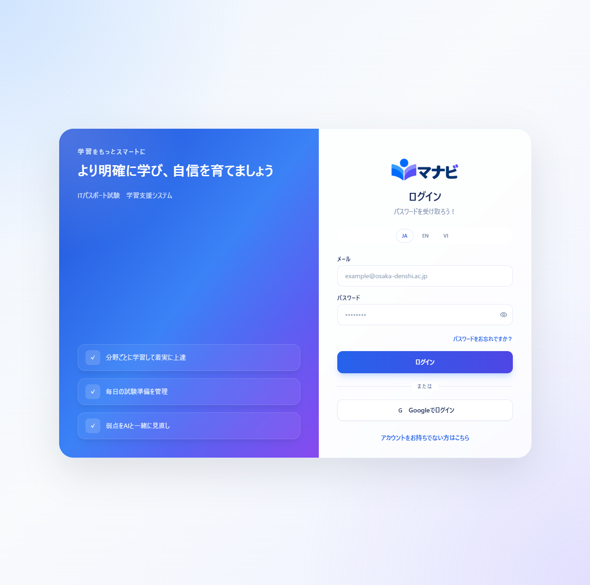
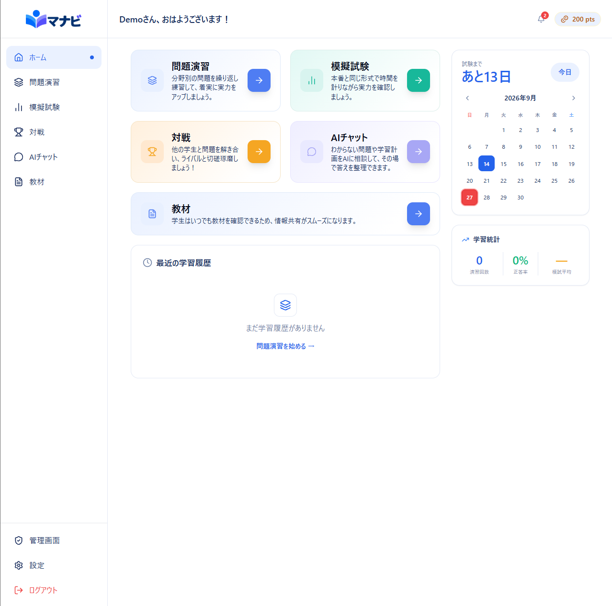
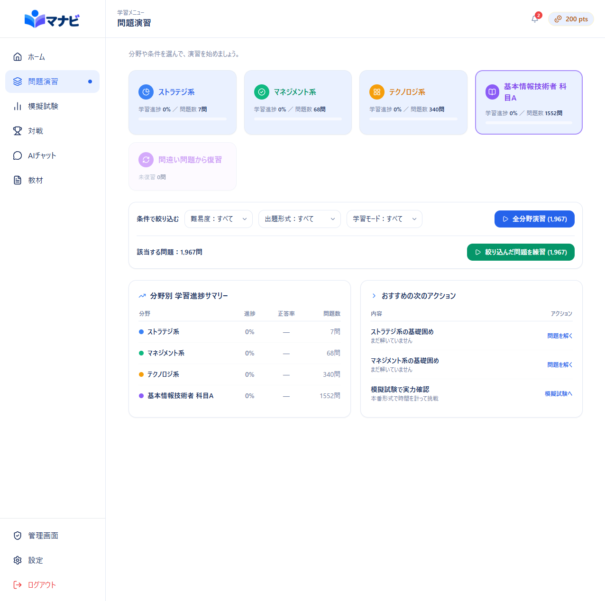
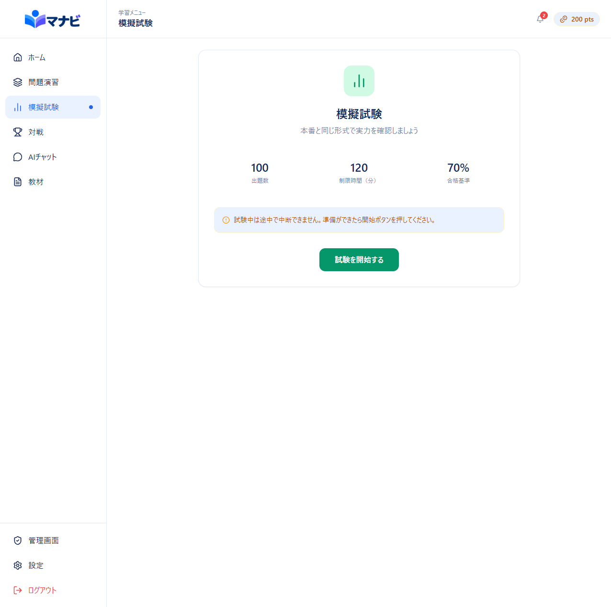
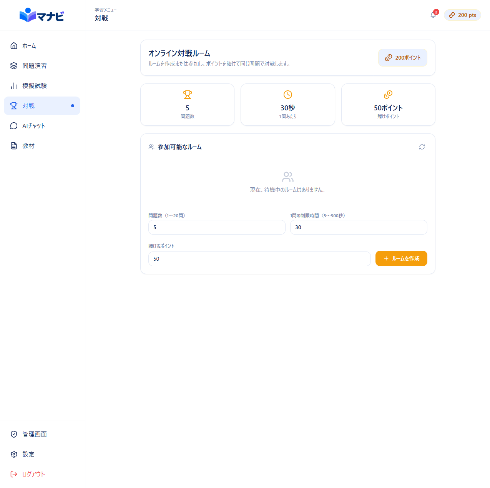
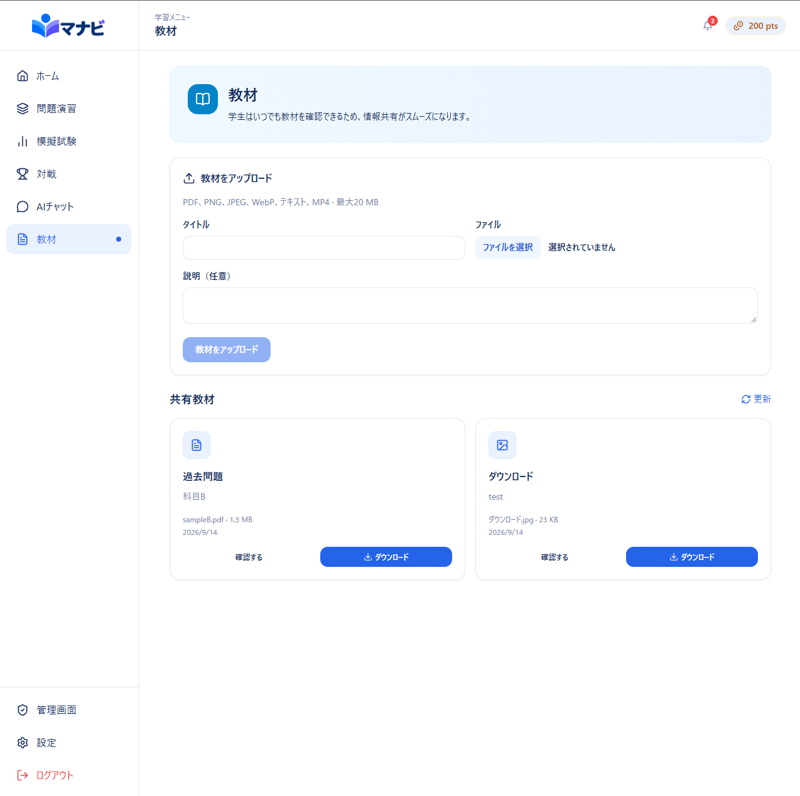
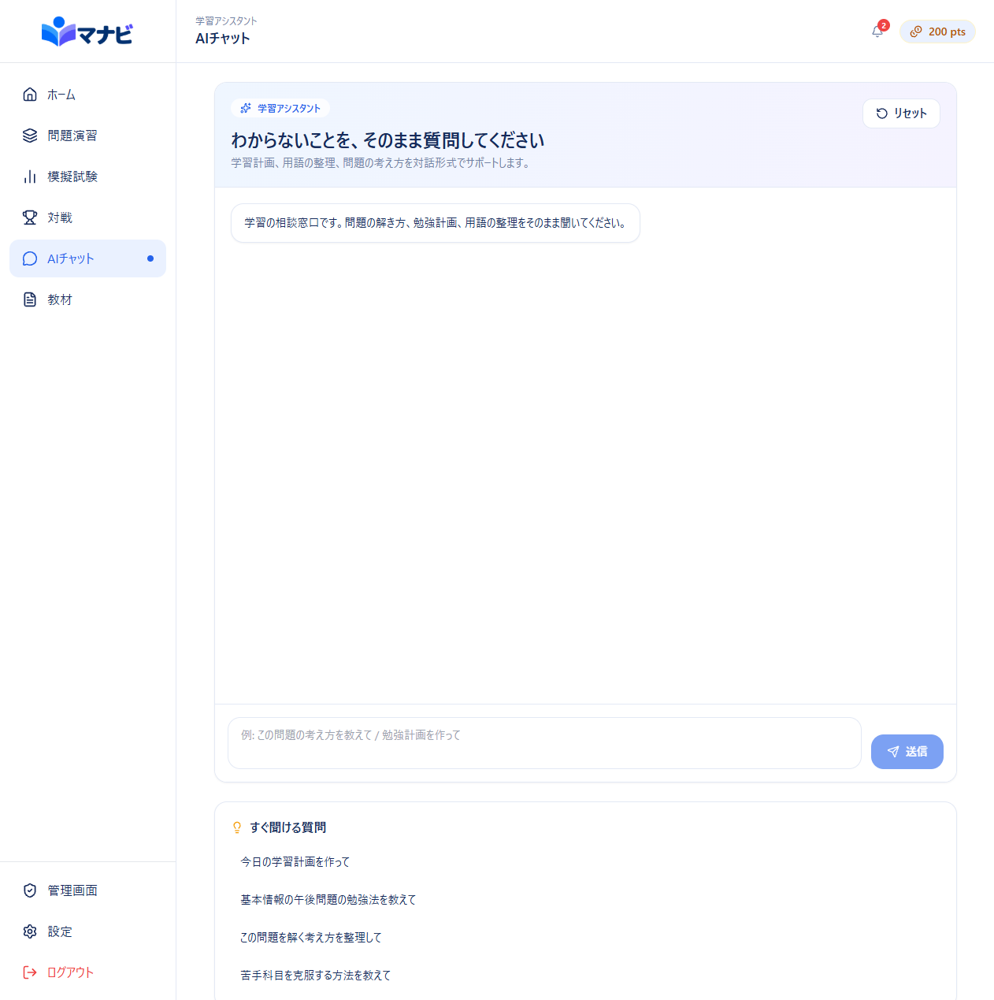
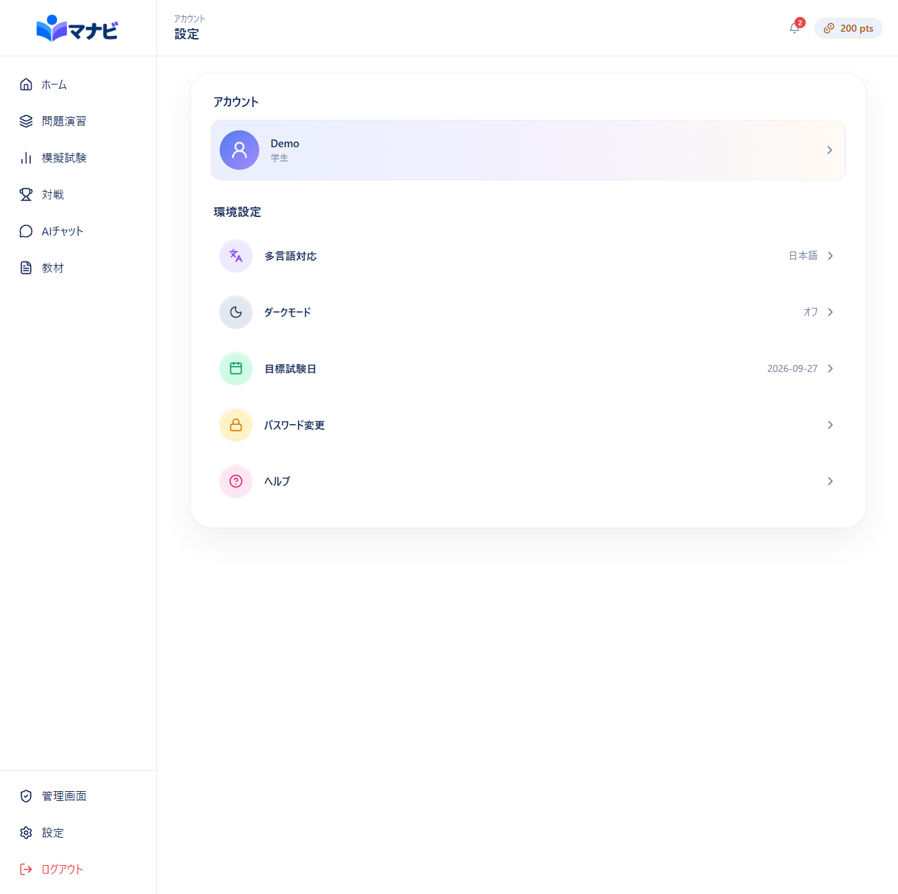
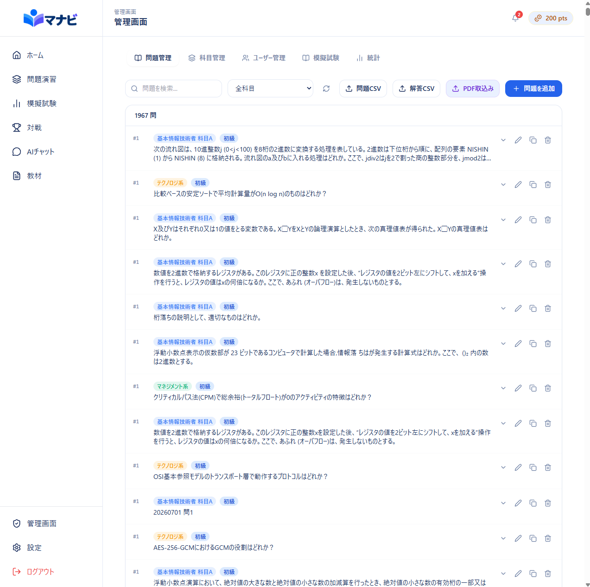

# Manabi IT Passport

Manabi IT Passport is a React and Supabase study app for the Japanese IT Passport exam. It includes practice questions, mock exams, multilingual explanations, admin content tools, and an AI study assistant with local fallback answers.

Website: [https://manabi-app.jp](https://manabi-app.jp)

## Screenshots



















## Features

- Authenticated learning dashboard with Supabase Auth, secure email password recovery, and local demo-mode fallback.
- Practice by subject, source exam date, question type, new questions, or missed-question review.
- Mock exam and battle-mode screens for timed and competitive study workflows.
- AI chat and per-question explanations through a Supabase Edge Function.
- Local AI fallback explanations when Supabase or Gemini is unavailable.
- Japanese, English, and Vietnamese localization.
- Shared materials: signed-in users can upload PDFs, images, and Office documents (up to 20 MB) to `files.manabi-app.jp`, then view or download files uploaded by others.
- Admin tools for questions, subjects, users, mock-exam settings, stats, CSV import, and searchable/scanned PDF question import with OCR fallback.
- Real browser URLs with route guards for signed-in and admin-only pages.
- Standardized CSV, scoring, auth, rate-limit, error, and data helper modules.

## Stack

- React 18
- TypeScript
- Vite
- React Router
- Tailwind CSS
- Supabase Auth, PostgreSQL, Row Level Security, and Edge Functions
- Gemini API via Supabase Edge Function
- PDF.js and Tesseract.js for question import workflows
- Vitest and React Testing Library
- npm

## Architecture

```text
src/
  App.tsx                    Route tree and guards
  contexts/                  Auth and language providers
  pages/                     Route-level screens
  components/
    admin/                   Admin importer, forms, and tab components
    ui/                      Shared loading/error UI
  hooks/                     Shared async data hooks
  lib/                       Supabase client, data services, CSV, scoring, AI, auth helpers
  i18n/                      Translation catalogs and helpers
  data/                      Bundled seed/question assets
supabase/
  migrations/                Database schema and policies
  functions/ai-chat/         Authenticated, rate-limited AI proxy
tests/
  lib/                       Auth and AI fallback tests
  pages/                     Route-level and interaction regression tests
  contexts/                  Provider and authentication lifecycle tests
  utils/                     CSV, scoring, and localization tests
```

Routing is handled in `src/App.tsx`. Signed-in pages are wrapped by `ProtectedRoute`; `/admin` is additionally wrapped by `AdminRoute`. The existing page components still receive `currentPage` and `onNavigate` so navigation UI remains simple while browser back/forward works.

Admin code is split into five tabs:

- `QuestionsTab`
- `SubjectsTab`
- `UsersTab`
- `MockExamTab`
- `StatsTab`

Shared admin form state lives in `src/components/admin/forms.ts`, and CSV parsing lives in `src/lib/csv.ts`.

## Setup

1. Install Node.js 20 or newer.
2. Install dependencies:

```bash
npm install
```

3. Create `.env.local`:

```bash
VITE_SUPABASE_URL=your_supabase_project_url
VITE_SUPABASE_ANON_KEY=your_supabase_anon_key
VITE_USE_SUPABASE=true
VITE_ALLOWED_ORIGINS=https://manabi-app.jp
VITE_MATERIAL_FILES_URL=https://files.manabi-app.jp
```

The separately deployed file server must provide `${VITE_MATERIAL_FILES_URL}/api/upload.php`, `${VITE_MATERIAL_FILES_URL}/api/download.php`, and `${VITE_MATERIAL_FILES_URL}/api/delete.php`. Upload `file-server/api/delete.php` beside the other API scripts; it allows uploaders to delete their own materials and administrators to delete any material.

4. Start the app:

```bash
npm run dev
```

5. Build for production:

```bash
npm run build
```

## Supabase

Apply every migration in `supabase/migrations` in filename order. With the Supabase CLI linked to the target project, run:

```bash
supabase db push
```

The migrations create the Manabi schema, authorization policies, password-recovery-compatible profiles, admin helpers, AI chat storage, practice-session persistence, points, battle RPCs, question import support, and shared-material metadata. Apply `20260914000000_add_shared_materials.sql` and `20260915000000_move_material_files_to_file_server.sql` before using the Materials tab. Material binaries are uploaded to `files.manabi-app.jp`; local demo mode cannot share files between users. Configure the Supabase Auth redirect allow list with `https://manabi-app.jp/login?recovery=1` so emailed password-reset links return to this application.

The unit tests validate the TypeScript wager boundary and duplicate UI submissions. Before production deployment, run Supabase integration checks confirming that invalid or insufficient wagers leave balances unchanged, concurrent create requests produce only one waiting room and one wager lock, and repeated cancellation requests produce exactly one refund ledger entry.

The AI Edge Function expects:

```bash
SUPABASE_URL=your_supabase_project_url
SUPABASE_ANON_KEY=your_supabase_anon_key
GEMINI_API_KEY=your_gemini_key
ALLOWED_ORIGIN=https://manabi-app.jp,https://itpassportwebapp-eta.vercel.app
GEMINI_MODEL=gemini-3.5-flash-lite
AI_RATE_LIMIT_MAX_REQUESTS=60
```

`ALLOWED_ORIGIN` is exact-match only. Multiple production origins can be comma-separated.
If these variables are already configured in Vercel or Supabase, update the deployed values to `https://manabi-app.jp` as well; changing the defaults in this repository does not override deployed environment settings.

## Tests

Run all tests:

```bash
npm test
```

Run the same non-watch test command used by CI:

```bash
npm test -- --run
```

Run static checks and a production build:

```bash
npm run typecheck
npm run lint
npm run build
```

Run coverage:

```bash
npm run test:coverage
```

Current focused coverage includes:

- CSV parser edge cases
- Scoring utilities
- Localization helpers
- AI fallback behavior and client-side rate limiting
- Auth token helpers
- Password recovery lifecycle and login-page validation
- Searchable PDF answer parsing and scanned-PDF OCR reconciliation
- Battle wager validation and duplicate-submit protection
- Page and component interaction regressions

## Data And Errors

Supabase calls should throw or surface errors instead of ignoring them. New shared helpers live in:

- `src/lib/errorHandling.ts`
- `src/lib/dataService.ts`
- `src/hooks/useData.ts`
- `src/components/ui/LoadingError.tsx`

## Package Management

This repository uses npm. `pnpm-lock.yaml` and `pnpm-workspace.yaml` were removed to avoid mixed package-manager state.
